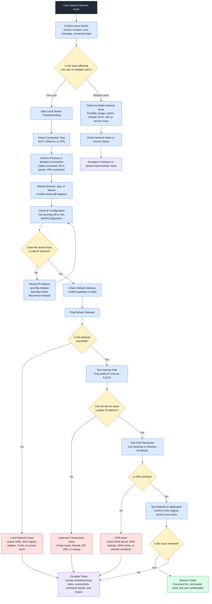

# Network Troubleshooting Flowchart

## Purpose

This diagram shows a clear help desk workflow for troubleshooting network connectivity issues. It is designed to be readable on GitHub without needing to zoom in.



## What This Diagram Demonstrates

* Help desk network troubleshooting workflow
* Single-user versus multiple-user issue checking
* Wi-Fi, Ethernet, and VPN troubleshooting
* IP address and DHCP troubleshooting
* Default gateway testing
* Internet connectivity testing
* DNS troubleshooting
* Application testing
* Escalation documentation

## Common Windows Commands

```powershell
ipconfig /all
ipconfig /release
ipconfig /renew
ping 127.0.0.1
ping 8.8.8.8
ping google.com
nslookup google.com
tracert google.com
```

## Common PowerShell Commands

```powershell
Get-NetIPConfiguration
Test-Connection 8.8.8.8
Resolve-DnsName microsoft.com
Get-DnsClientServerAddress
```

## Example Help Desk Scenarios

| Scenario                                              | First Area to Check                       |
| ----------------------------------------------------- | ----------------------------------------- |
| User cannot access any websites                       | IP configuration and DNS                  |
| User is connected to Wi-Fi but internet does not work | Gateway and DNS checks                    |
| One laptop has no connection                          | Local device and adapter checks           |
| Multiple users cannot connect                         | Wider network or outage check             |
| User can ping IP but not domain names                 | DNS troubleshooting                       |
| VPN user cannot reach internal resources              | VPN, routing, DNS, and permissions        |
| Application works for others but not one user         | Local profile, browser, app, or DNS cache |

## Escalation Notes to Include

When escalating the ticket, include:

* User impact
* Device name
* Network type: Wi-Fi, Ethernet, or VPN
* Error messages
* IP address status
* Gateway ping result
* Public IP ping result
* DNS test result
* Application or website tested
* Screenshots if available
* Troubleshooting already completed

## Portfolio Note

This diagram is part of a networking troubleshooting lab designed to demonstrate IT Support, Help Desk, Desktop Support, and Junior Systems Administrator troubleshooting workflows.
