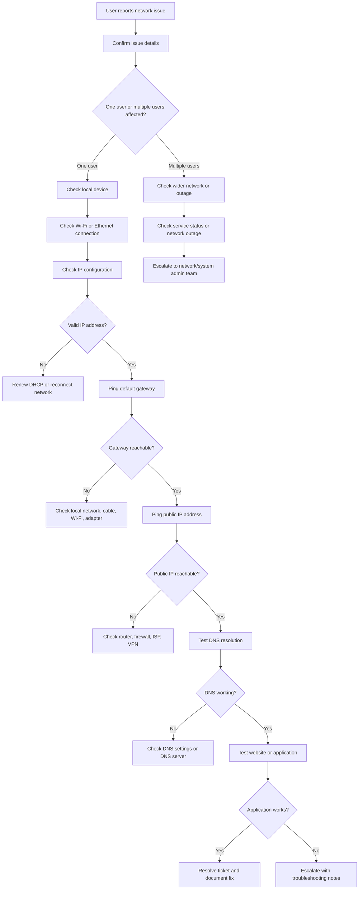

# Network Troubleshooting Flowchart

## Purpose

This flowchart shows a basic IT support and help desk workflow for troubleshooting network connectivity issues.



## What This Diagram Demonstrates

- Basic network troubleshooting workflow
- Single-user vs multi-user issue checking
- DHCP and IP troubleshooting
- Gateway testing
- Public connectivity testing
- DNS troubleshooting
- Escalation process
- Help desk documentation workflow

## Common Commands

### Windows Commands

```powershell
ipconfig /all
ping 8.8.8.8
ping google.com
nslookup google.com
tracert google.com
```

### PowerShell Commands

```powershell
Get-NetIPConfiguration
Test-Connection 8.8.8.8
Resolve-DnsName microsoft.com
```

## Example Use Cases

- User cannot browse the internet
- User can connect to Wi-Fi but websites do not load
- DNS issue affecting one workstation
- Possible DHCP issue
- Local adapter or cable problem
- VPN-related connectivity issue
- Wider network outage requiring escalation
